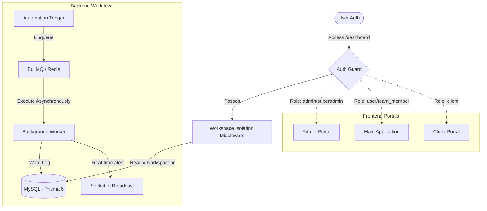

# VaultEXP Master Platform Documentation

Welcome to the central documentation hub for the **VaultEXP Platform**. This document serves as the entry point and structural map for the entire codebase, architecture, and business operations of the VaultEXP SaaS ecosystem.

---

## Table of Contents

1. [System Overview](#system-overview)
2. [Platform Architecture](#platform-architecture)
3. [Feature Index](#feature-index)
4. [Dashboard Index](#dashboard-index)
5. [Module Map](#module-map)
6. [Database Overview](#database-overview)
7. [AI System Overview](#ai-system-overview)
8. [Authentication Overview](#authentication-overview)
9. [API Overview](#api-overview)
10. [Real-time / Socket Overview](#real-time--socket-overview)
11. [Automation Overview](#automation-overview)
12. [Deployment Overview](#deployment-overview)
13. [Security Overview](#security-overview)
14. [User Roles Overview](#user-roles-overview)
15. [Internal Workflow Map](#internal-workflow-map)
16. [Directory Structures & Navigation](#directory-structures--navigation)

---

## System Overview

VaultEXP is an **enterprise-grade, AI-powered Multi-Tenant SaaS platform** engineered for managing business assets, property portfolios, investments, and financial vaults in a single workspace. The system is designed to provide users with a secure, highly interactive desktop and mobile environment, while delivering a robust REST and Socket backend powered by automated cron triggers, asynchronous task queues, and integrated Large Language Models (LLMs).

---

## Platform Architecture

VaultEXP runs a decoupled Client-Server architecture:
*   **Frontend:** [Next.js 14 App Router](file:///C:/Users/meeti/Downloads/VaultWebApp/client/app) using TypeScript, Tailwind CSS, TanStack Query (v5), Framer Motion, and Zustand for global state.
*   **Backend:** [Express.js](file:///C:/Users/meeti/Downloads/VaultWebApp/server/src/app.js) in Node.js, utilizing a safe module loading system, MySQL as the primary database mapped via [Prisma 6](file:///C:/Users/meeti/Downloads/VaultWebApp/server/prisma/schema.prisma), and Redis/BullMQ for queues (disabled in standard dev environment).
*   **Portals:** The platform is segmented into three isolated portals:
    1.  **Main Application Portal:** `/dashboard` for business owners and investors.
    2.  **Admin Portal:** `/admin/dashboard` for system operators.
    3.  **Client Portal:** `/client/dashboard` for guest clients invited by hosts.

For a deep dive, see:
*   [Architecture System Overview](file:///C:/Users/meeti/Downloads/VaultWebApp/docs/architecture/system_overview.md)
*   [Portal Isolation Architecture](file:///C:/Users/meeti/Downloads/VaultWebApp/docs/architecture/portal_isolation.md)

---

## Feature Index

| Feature | Primary Purpose | Scope | Key Models |
|---|---|---|---|
| **Financial OS** | Multi-account wallets, general ledger entries, cash-flow reports, invoices, and expense categorization. | Main app, Clients | `Wallet`, `Transaction`, `LedgerEntry`, `Invoice`, `Expense`, `FinancialCategory` |
| **CRM Engine** | Lead management, deals pipelines, activities tracking, and contact interactions. | Main app | `CRMContact`, `CRMPipeline`, `CRMStage`, `CRMDeal`, `CRMNote`, `CRMActivity` |
| **Document Vault** | Nested folder system, tags, document reminders, and AI-enabled chat/OCR analysis. | All Portals | `Document`, `DocumentFolder`, `DocumentTag`, `DocumentReminder`, `DocumentAIAnalysis` |
| **AI Assistant** | Global orb panel, page context analysis, automated document indexing, and AI advisor. | All Portals | Chat/Completion APIs, Local Prompts context |
| **Workflow Automation** | Drag-and-drop rule builder, triggers, BullMQ schedules, and event-driven chains. | Main app | `Alert`, Queue systems |
| **Realtime Chat/Sync** | Dynamic team messaging, document collaboration comments, and push notifications. | All Portals | `ChatChannel`, `ChatMessage`, `ChatParticipant`, `Comment`, `Notification` |

---

## Dashboard Index

### 1. Main App Dashboard (`/dashboard`)
*   **Purpose:** Summarize entire workspace assets, wallet balances, properties, tasks, active invoices, and CRM leads.
*   **Widgets:** Financial summary line charts, Quick Actions FAB, Property occupancy rate tracker, Recent Activities log, Active Alerts ribbon.

### 2. Admin Dashboard (`/admin/dashboard`)
*   **Purpose:** Platform management, billing audit, usage trackers (AI tokens, API calls), user roles management.
*   **Widgets:** Total Revenue (Stripe sync), active subscriptions, support ticket count, AI token consumption gauges, Server/DB status monitor.

### 3. Client Portal Dashboard (`/client/dashboard`)
*   **Purpose:** Shared portal workspace for external clients.
*   **Widgets:** Pending invoices checklist, shared document downloads, portal messaging interface, signature agreement requests.

---

## Module Map

The backend consists of modular controllers located in `server/src/modules/`:
```
server/src/modules/
├── auth/            ← Authentication services
├── user/            ← Profile management
├── business/        ← Multi-tenant businesses
├── property/        ← Rental properties & tenants
├── investment/      ← Stock, Crypto, Manual asset portfolios
├── wallet/          ← Banking accounts & transaction ledgers
├── financial/       ← Cash flows, PNL reports, invoicing
├── document/        ← Cloudinary/Multer file vault
├── crm/             ← Pipelines, deals, notes
├── automation/      ← Workflows builder & triggers
├── analytics/       ← SQL aggregates for charts
├── notification/    ← Sockets, push notifications, preferences
├── security/        ← Security audit logs
├── workspace/       ← Tenancy isolation configs
└── client/          ← Client portal endpoints
```

---

## Database Overview

The system runs on **MySQL** managed through **Prisma 6**. All entities are scoped via relations. High-scale operations use compound indexes, foreign key constraints, and soft-delete dates (`deletedAt`).
*   **Schema Path:** [Prisma Schema](file:///C:/Users/meeti/Downloads/VaultWebApp/server/prisma/schema.prisma)
*   **Key Relations:** Users own Workspaces. Workspaces isolate Business/Property data. Businesses own CRM contacts, Transactions, and Invoices. Properties link to Tenants, RentRecords, and Expenses.

For a detailed review, see:
*   [Database & Prisma Schema Guide](file:///C:/Users/meeti/Downloads/VaultWebApp/docs/database/prisma_schema.md)

---

## AI System Overview

VaultAI is structured as an adaptive contextual system:
*   **Global Orb:** Floating widget (`FloatingAIOrb.tsx`) triggering the slide-over sidebar panel.
*   **Workspace Scoped Context:** The AI reads `x-workspace-id` and queries only user-owned active scope records, preventing data leaks.
*   **Submodules:**
    *   *AI Financial Advisor:* Parses transactional ledger records and yields automated portfolio insights.
    *   *AI Document OCR:* Analyzes uploaded files, indexes texts, and enables conversational document Q&A.
    *   *AI CRM assistance:* Synthesizes pipeline deal updates into quick activity notes.

For more details, see:
*   [AI Assistant System Design](file:///C:/Users/meeti/Downloads/VaultWebApp/docs/ai/ai_assistant.md)

---

## Authentication Overview

VaultEXP uses a **stateless, JWT-based auth flow** with access tokens passed in HTTP Authorization headers (`Bearer <token>`).
*   **Frontend Storage:** Zustand persistent store (`authStore.ts`) encrypted inside `localStorage` via a custom XOR/Base64 wrapper (`secureStorage.ts`).
*   **Hydration Sync:** Hydration guards prevent flash-of-unauthenticated-content (FOUC).
*   **Backend Guard:** JWT validation middleware (`auth.middleware.js`) decoding payload and populating `req.user`.

For more details, see:
*   [Authentication flow](file:///C:/Users/meeti/Downloads/VaultWebApp/docs/authentication/auth_flow.md)

---

## API Overview

All routes are registered under `/api/` in Express.
*   **Interceptors:** Frontend Axios interceptor dynamically injects `Authorization: Bearer <token>` and `x-workspace-id: <workspaceId>`.
*   **Defensive Routing:** Backend routes mount via a custom `safeLoad()` module wrapper to prevent server crashes on individual module import failure.

For the full endpoint reference, see:
*   [API Endpoints Reference](file:///C:/Users/meeti/Downloads/VaultWebApp/docs/api/endpoints.md)

---

## Real-time / Socket Overview

Powered by **Socket.io**:
*   **Connection:** Initiated post-authentication inside `SocketProvider.tsx`.
*   **Namespaces/Rooms:** Authenticated users join rooms corresponding to their `x-workspace-id` and dynamic user IDs.
*   **Broadcasts:** Real-time updates occur on:
    *   New team notifications
    *   Active chat room messages
    *   Collaborative document editing comments
    *   Offline device sync reconciliation

For configuration details, see:
*   [Sockets Real-time Architecture](file:///C:/Users/meeti/Downloads/VaultWebApp/docs/realtime/sockets.md)

---

## Automation Overview

Automations run on an event-driven framework:
*   **Scheduler:** Quartz/Cron schedules trigger repeating tasks (e.g., invoice generation on billing day, rental overdue status update).
*   **Queue Handler:** BullMQ backed by Redis handles heavy asynchronous workloads (OCR parsing, document index updates, webhooks delivery).
*   **Builder:** Frontend builders compile graphical flowchart triggers into JSON configurations parsed by the backend execution engine.

For deep dive details, see:
*   [Automation Engine Systems](file:///C:/Users/meeti/Downloads/VaultWebApp/docs/automation/engine.md)

---

## Deployment Overview

*   **Backend Hosting:** Express server is configured for deployment on Railway (linked with a MySQL add-on).
*   **Frontend Hosting:** Next.js application deploys onto Vercel with automatic rewrites mapping `/api/*` proxies.
*   **CORS Policies:** Configured in `app.js` based on environment configurations, allowing secure cookies transfer.

For setup steps, see:
*   [Deployment & Environment Configurations](file:///C:/Users/meeti/Downloads/VaultWebApp/docs/deployment/guide.md)

---

## Security Overview

The platform uses a layered security model:
1.  **Transport/Request Security:** Helmet headers, rigid CORS configurations, rate limiters, payload size validators.
2.  **Authentication Security:** Argon2/Bcrypt password hashing, JWT expiration bounds, local storage token XOR obscuring.
3.  **Data Partitioning:** Workspace isolation middleware scoping all database queries.
4.  **Audit Logs:** Automated logging of critical operations via security and activity ledgers.

For security policies, see:
*   [Security and Audit Guide](file:///C:/Users/meeti/Downloads/VaultWebApp/docs/security/audit.md)

---

## User Roles Overview

The system supports five roles (`UserRole` enum):
1.  **SUPER_ADMIN:** Complete system oversight, configuration overrides, and platform analytics.
2.  **ADMIN:** Moderate users, inspect support issues, view system status.
3.  **USER:** Standard SaaS tenant with complete access to financial, property, and CRM portfolios.
4.  **TEAM_MEMBER:** Multi-tenant workspace worker with collaborative permissions.
5.  **CLIENT:** Restricted external user viewing shared folders, invoices, and message portals.

For RBAC details, see:
*   [Role Based Access Control Matrix](file:///C:/Users/meeti/Downloads/VaultWebApp/docs/user-roles/rbac.md)

---

## Internal Workflow Map



For full diagram flows, see:
*   [Workflows and Data Flows Guide](file:///C:/Users/meeti/Downloads/VaultWebApp/docs/workflows/data_flows.md)
