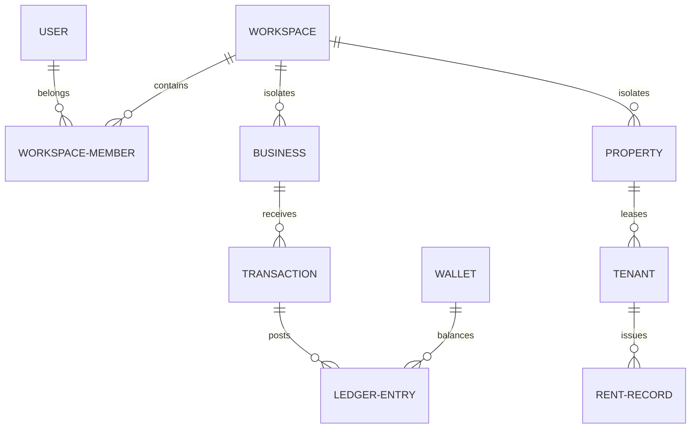

# Database Schema & Relations (Prisma 6)

VaultEXP uses **MySQL** as its core database, managed through the **Prisma 6** Object-Relational Mapper (ORM). This document breaks down the database design, model descriptions, enums, indexed properties, and schema scaling patterns.

---

## 1. Database Architecture & Conventions

### Model Design Patterns
*   **Primary Keys:** All models utilize `cuid()` strings (`id String @id @default(cuid())`) rather than auto-incrementing integers to ensure distributed scaling capability.
*   **Database Mapping:** File field names are standard `camelCase` mapped to database `snake_case` column headers using the `@map` directive:
    ```prisma
    passwordHash String? @map("password_hash")
    ```
*   **Table Pluralization:** All physical table structures employ plural snake_case names defined by the `@@map` directive:
    ```prisma
    @@map("users")
    ```
*   **Soft Deletion:** Business and transactional tables incorporate a `deletedAt DateTime? @map("deleted_at")` field, coupled with indexing, to prevent physical data loss.

---

## 2. Core Model Schemas

The database schema defines approximately 27 primary tables structured into modular domains:

### A. User Management Domain

#### `User` Model
Represents workspace accounts:
*   `id`: Primary key cuid.
*   `email`: String (Unique, Indexed).
*   `role`: UserRole Enum (`SUPER_ADMIN`, `ADMIN`, `CLIENT`, `USER`, `TEAM_MEMBER`).
*   `status`: UserStatus Enum (`active`, `inactive`, `suspended`).
*   `lockedUntil`: DateTime? representing account lock timeouts.

### B. Tenancy Domain

#### `Workspace` Model
Isolates account segments:
*   `id`: Primary key cuid.
*   `name`: String.
*   `members`: WorkspaceMember relation array.

#### `WorkspaceMember` Model
Defines workspace membership:
*   `workspaceId` & `userId`: Scoped keys mapping relations.
*   `role`: String (e.g., `owner`, `member`).
*   `@@unique([workspaceId, userId])` to prevent duplicate memberships.

---

## 3. Business & Asset Domains

### `Business` Model
Tracks businesses owned by users:
*   `workspaceId`: References `Workspace.id`.
*   `type`: BusinessType Enum (`llc`, `corporation`, `partnership`...).
*   `expenses`: Relation array of Expense records.
*   `invoices`: Relation array of Invoice records.

### `Property` Model
Manages rental assets:
*   `workspaceId`: References `Workspace.id`.
*   `type`: PropertyType Enum (`residential`, `commercial`, `industrial`...).
*   `status`: PropertyStatus Enum (`owned`, `rented_out`, `vacant`...).
*   `tenants`: Relation array of Tenant leases.

---

## 4. Financial OS & Ledger Domain

### `Wallet` Model
Represents checking or savings ledgers:
*   `type`: WalletAccountType Enum (`checking`, `savings`, `credit`, `crypto`...).
*   `balance`: Decimal value representing verified holdings.

### `Transaction` Model
Records currency movement:
*   `type`: TransactionType Enum (`income`, `expense`, `transfer`).
*   `status`: TransactionStatus Enum (`completed`, `pending`, `failed`).
*   `walletId`: References `Wallet.id`.
*   `ledgerEntries`: Relation array of LedgerEntries.

### `LedgerEntry` Model
Low-level ledger record:
*   `debit`: Decimal amount.
*   `credit`: Decimal amount.
*   `balance`: Decimal balance after transaction execution.
*   `@@index([walletId, entryDate(sort: Desc)])` for fast chart rendering.

---

## 5. Model Relationship Diagram



---

## 6. Scaling & Performance Design Rules

1.  **Strict Compound Indexes:** To prevent slow queries as database size grows, compound indexes are declared for tenant-specific lookups:
    ```prisma
    @@index([userId, status])
    ```
2.  **Cascading Deletes:** Deleting a root record propagates down relationships (e.g., deleting a `CRMContact` deletes associated `CRMNote` and `CRMActivity` rows automatically via `onDelete: Cascade`).
3.  **Decimal Precision:** To avoid floating-point errors, all currency columns use the Decimal type:
    ```prisma
    value Decimal @default(0) @db.Decimal(18, 2)
    ```
